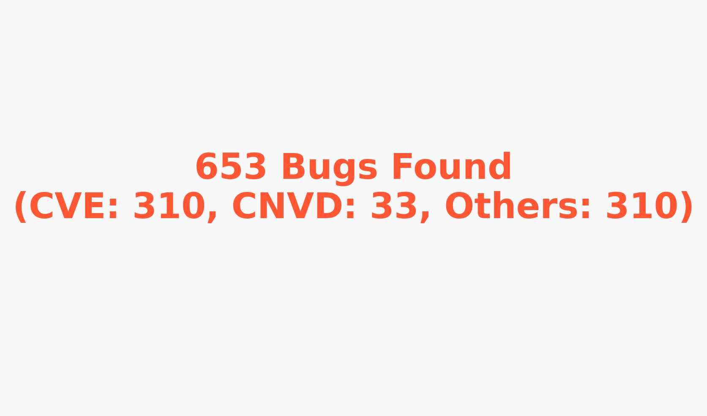

## Introduction
We have detected 1000+ bugs for OS(linux, ROS, etc), database(MariaDB, MySQL, etc), block-chain, protocol systems as well as OSS projects.

For detailed information on the bugs we've identified, visit the following links:
- [CVE Details](res/CVE.md)
- [CNVD Details](res/CNVD.md)
- [Other Bugs Details](res/others.md)

